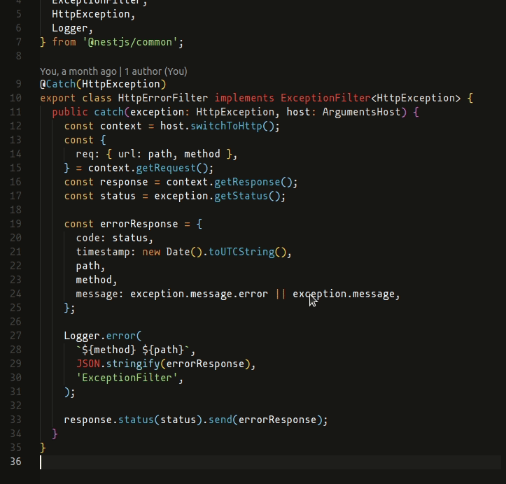
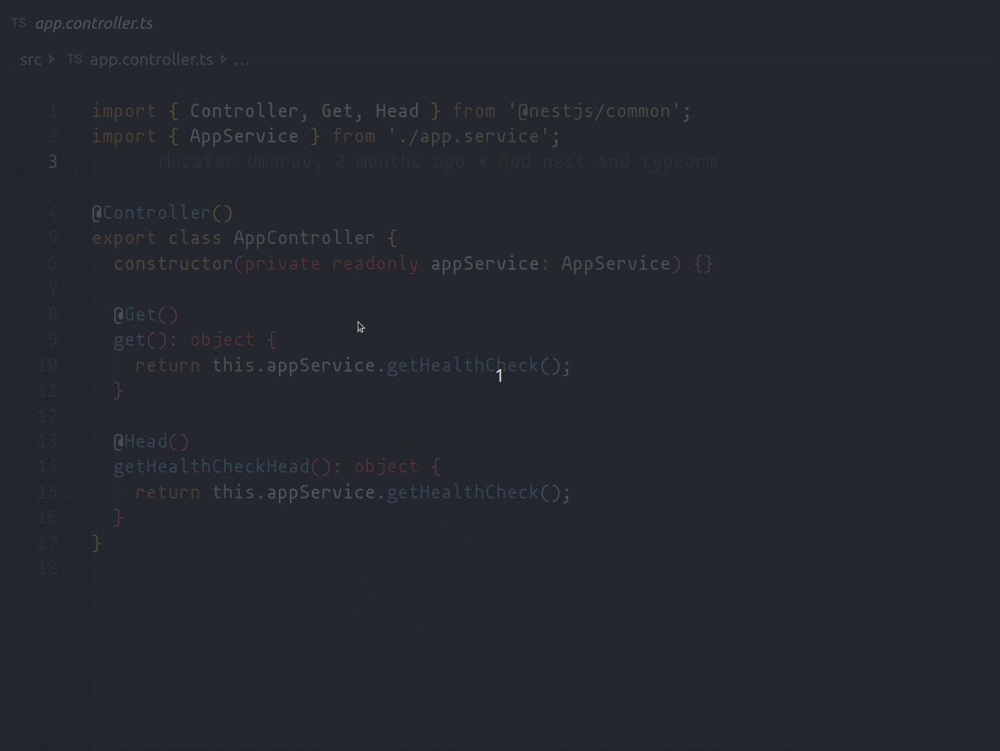

# Know your tools

## VS Code

### Command Pallet

- `Command` + `Shift` + `P` or `Control` + `Shift` + `P`

### Breadcrumbs

### Snippets

- Custom Snippets
  

- Built in snippets
  

- [Sarah Drasner's Vue Snippets](https://marketplace.visualstudio.com/items?itemName=sdras.vue-vscode-snippets)
  

- [JS ES6 Snippets](https://marketplace.visualstudio.com/items?itemName=xabikos.JavaScriptSnippets)
  

### Vetur

- Syntax Highlighting
- Snippets
- Linting
- Autocomplete
- Error checking

### Emmet

### Smart selection expansion

### Jump back to previous cursor or selection

- `Command` + `U` or `Control` + `U` to jump back

### Reopen previously closed file

- `Command` + `Shift` + `T` or `Control` + `Shift` + `T`

### Multi cursor

### Indenting with `Control` + `[` or `]`

### Terminal

- Split Terminals `Control` + `\`
- Move between them with `Alt`
- Change direction
- Being able to use your own shell
- Expand terminal
- Terminal tabs
- Terminal tabs for workspaces (mention in the workspaces section)

### Closing tabs in one group, closing tabs in the whole window

### Zen Mode

- `Command` + `K` `Z` or `Control` + `K` `Z`

### Live Share

- Share code
- Share terminal
- Share server

### Prettier to Format the code

### JS Type checking

### GitLens

### Settings Sync

- Use gist to upload/download settings
- Auto-upload every time a setting/extension/shortcut/snippet changes
- Auto-download on booting VS Code

### Project Manager

- Provide a directory with projects
- Switch between them with `Alt` + `Shift` + `P`

### Workspaces

- Including multiple projects in one VS Code window
- Being able to open terminals for each
- Combined Git experience

### Debugging Node and Vue projects

- `Command` + `Shift` + `D`
- Log point
- Log point with variables

### Browser Preview

- Debugging on browser preview

### Auto imports on TypeScript projects

### Refactoring

### Other cool extensions

- [markdownlint](https://marketplace.visualstudio.com/items?itemName=DavidAnson.vscode-markdownlint)
- [Log File Highlighter](https://marketplace.visualstudio.com/items?itemName=emilast.LogFileHighlighter)
- [Import Cost](https://marketplace.visualstudio.com/items?itemName=wix.vscode-import-cost)
